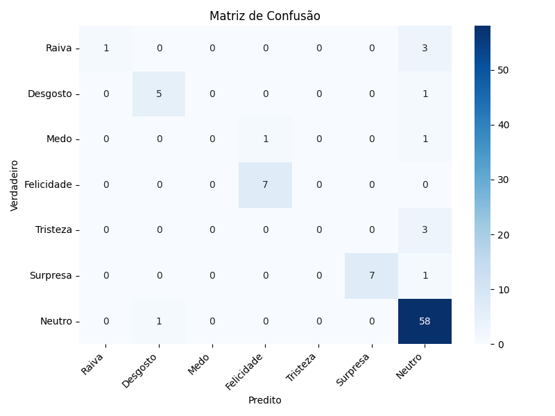

# Realtime Emotion Detection

## Visão Geral do Projeto

O **Realtime Emotion Detection** é um projeto de aprendizado de máquina que utiliza visão computacional para detectar e classificar emoções faciais em tempo real através da câmera do computador. Desenvolvido em Python, ele emprega uma Rede Neural Convolucional (CNN) treinada em dados de expressões faciais para identificar emoções como Raiva, Desgosto, Medo, Felicidade, Tristeza, Surpresa e Neutro.
O projeto também envolve tratamento e analise de dados para garantir a eficiência do modelo.

## Funcionalidades Principais

* **Detecção Facial em Tempo Real:** Utiliza o OpenCV para identificar rostos no feed de vídeo da câmera.
* **Predição de Emoções:** Um modelo de Deep Learning (CNN) analisa as expressões faciais para prever a emoção predominante.
* **Visualização Interativa:** Exibe a emoção predita e a confiança na tela, sobrepondo-as aos rostos detectados.
* **Baseado em Dataset CK+ Extended:** Modelo treinado e validado em um dataset de expressões faciais reconhecido.

## Tecnologias Utilizadas

* **Python 3.10+** (Recomendado: Python 3.10 ou 3.11 para compatibilidade com TensorFlow)
* **TensorFlow / Keras:** Para construção e treinamento do modelo de Deep Learning.
* **OpenCV (`opencv-python`):** Para acesso à câmera, captura de vídeo e detecção facial.
* **NumPy:** Para manipulação eficiente de dados numéricos (pixels de imagem).
* **Pandas:** Para manipulação e análise do dataset.
* **Scikit-learn:** Para métricas de avaliação do modelo (relatório de classificação, matriz de confusão).
* **Matplotlib e Seaborn:** Para visualização de dados e gráficos.

## Performance do Modelo

O modelo de CNN foi treinado com o dataset CK+ Extended e avaliado no conjunto de teste. Ele alcançou uma **acurácia geral de 88%**, o que é um resultado promissor.

Para uma análise mais detalhada, o relatório de classificação e a matriz de confusão revelam os seguintes insights:

### Relatório de Classificação (Resumo do Desempenho por Emoção)

| Emoção     | Precision | Recall | F1-Score | Support |
| :--------- | :-------- | :----- | :------- | :------ |
| Raiva      | 1.00      | 0.25   | 0.40     | 4       |
| Desgosto   | 0.83      | 0.83   | 0.83     | 6       |
| Medo       | 0.00      | 0.00   | 0.00     | 2       |
| Felicidade | 0.88      | 1.00   | 0.93     | 7       |
| Tristeza   | 0.00      | 0.00   | 0.00     | 3       |
| Surpresa   | 1.00      | 0.88   | 0.93     | 8       |
| Neutro     | 0.87      | 0.98   | 0.92     | 59      |

* **Acurácia Geral:** 0.88
* **Média Ponderada (weighted avg):** Precision 0.83, Recall 0.88, F1-Score 0.84

**Observações:**

* **Pontos Fortes:** O modelo demonstra excelente capacidade de identificar **Felicidade**, **Surpresa** e **Neutro**, com F1-Scores superiores a 0.90 para essas classes. O alto "support" para "Neutro" contribui significativamente para a acurácia geral.
* **Pontos Fracos:** O modelo tem dificuldade significativa com **Medo** e **Tristeza**, apresentando F1-Scores de 0.00. Isso é primariamente devido ao **número extremamente baixo de amostras (support)** dessas emoções no conjunto de teste. A emoção **Raiva** também apresenta um Recall baixo (0.25), indicando que a maioria das instâncias de raiva não são detectadas corretamente, apesar de, quando preditas, serem geralmente corretas (Precision 1.00).

### Matriz de Confusão



## Configuração do Ambiente

Siga estes passos para configurar o ambiente e executar o projeto:

### 1. Pré-requisitos

* Certifique-se de ter o **Python 3.10 ou 3.11** instalado no seu sistema. Você pode baixá-lo em [python.org](https://www.python.org/downloads/). Durante a instalação, **lembre-se de marcar a opção "Add Python to PATH"**.

### 2. Clonar o Repositório (se estiver no GitHub)

```bash
git clone [https://github.com/SeuUsuario/EmotionNet-Cam.git](https://github.com/SeuUsuario/EmotionNet-Cam.git)
cd EmotionNet-Cam


